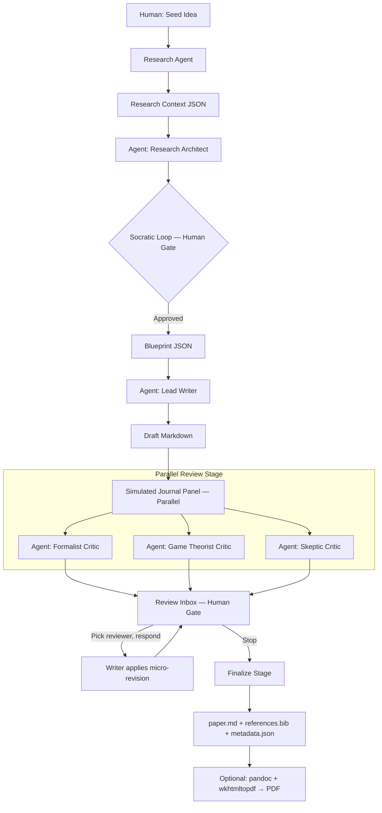

# Product Requirements Document — Agentic CS Paper Makers

## 1. Overview

Agentic CS Paper Makers is a CLI-first, GUI-ready academic paper generation workflow. It uses a multi-agent architecture orchestrated entirely in Go to produce structured, theoretical computer science and game theory papers. The workflow prioritizes human oversight at critical gates, real literature grounding via web search, and checkpoint persistence to survive crashes or token budget exhaustion.

**Target user:** Solo researchers or small teams producing papers for preprint servers (Zenodo) and professional networks (LinkedIn). Not for peer-reviewed journal submission — "academic rigor" is a quality aspiration, not a submission guarantee.

**Core philosophy:** One paper per workflow. Human-in-the-loop when it matters. Start from a seed idea, ground it in real literature, iterate via an inbox-style review system, and finalize to Markdown with optional PDF export.

---

## 2. Architecture

### 2.1 Language Stack

| Layer | Language | Responsibility |
|---|---|---|
| CLI, Orchestrator & LLM Bridge | Go | Commands, state machine, checkpointing, schema validation, LLM API calls, web search, tool execution, cross-OS binary distribution |

The Go binary is fully self-contained. No external runtime dependency. All LLM calls (Kimi/Moonshot), web search (arXiv, Semantic Scholar), and tool execution are implemented as Go packages under `internal/`.

### 2.2 Workflow Diagram



### 2.3 Execution Model

- **Sequential** where order matters: Research → Architect → Writer → Review Panel dispatch
- **Parallel** where independence allows: The 3 Critics run concurrently via Go goroutines
- **Async inbox:** Human picks any reviewer's critique in any order, writes a response, and the Writer generates a micro-revision. This loops until the human says `stop`.

---

## 3. Artifact Schema (JSON Contracts)

All inter-agent communication uses versioned JSON files stored in `.paperflow/artifacts/`.

### 3.1 Research Context (`research_context_v1.json`)

```json
{
  "version": "1.0",
  "stage": "research",
  "seed": "Byzantine Fault Tolerance using Stackelberg competition",
  "query_keywords": ["byzantine", "stackelberg", "fault tolerance"],
  "sources": [
    {
      "source": "arxiv",
      "query": "byzantine fault tolerance game theory",
      "papers": [
        {
          "title": "...",
          "authors": ["..."],
          "year": 2024,
          "abstract": "...",
          "url": "https://arxiv.org/abs/..."
        }
      ]
    }
  ],
  "synthesis_summary": "2-3 sentences...",
  "tokens_used": 1240
}
```

### 3.2 Research Blueprint (`blueprint_v1.json`)

```json
{
  "version": "1.0",
  "stage": "blueprint",
  "title": "Byzantine Fault Tolerance as Stackelberg Competition",
  "research_context_id": "sha256-of-input",
  "formal_model": {
    "game_type": "Stackelberg",
    "players": ["leader", "follower"],
    "assumptions": ["leader move observable"],
    "equilibrium_claims": ["subgame perfect equilibrium exists"]
  },
  "proof_obligations": ["prove leader strategy is optimal"],
  "human_approved": false
}
```

### 3.3 Draft (`draft_v{N}.json`)

```json
{
  "version": "1.0",
  "stage": "draft",
  "body_markdown": "# Title\n\n## Introduction\n...",
  "citation_placeholders": [
    {"placeholder": "[@smith2024]", "title": "...", "url": "..."}
  ],
  "tokens_used": 15420
}
```

### 3.4 Review Round (`review_round_v{N}.json`)

```json
{
  "round": 1,
  "reviews": {
    "formalist": { "content": "...", "status": "pending" },
    "game_theorist": { "content": "...", "status": "addressed" },
    "skeptic": { "content": "...", "status": "skipped" }
  },
  "human_responses": {
    "game_theorist": {
      "human_says": "I agree equilibrium proof is weak. Writer, add Lemma 3.",
      "writer_revision_applied": true
    }
  },
  "meta_reviewer_notes": {
    "contradictions": [
      "formalist wants MORE math, skeptic says math is irrelevant — pick one?"
    ]
  }
}
```

---

## 4. Agent Definitions

Agents are defined in `.md` profile files embedded in the Go binary via `//go:embed`. The orchestrator loads the appropriate profile and passes it as the system prompt to the Kimi/Moonshot API.

### 4.1 Research Agent
- **Role:** Literature scout
- **Tools:** `search_arxiv`, `search_semantic_scholar`
- **Input:** Raw seed string
- **Output:** `research_context_v1.json`
- **Behavior:** Extracts keywords, queries free APIs, returns top-5 papers with synthesis

### 4.2 Research Architect
- **Role:** Socratic framework builder
- **Input:** `research_context_v1.json` + human seed
- **Output:** `blueprint_v1.json`
- **Behavior:** Asks 3–5 clarifying questions via CLI prompt. Produces a formal model spec. **Does not write prose.**

### 4.3 Lead Writer
- **Role:** Prose generator
- **Input:** Approved `blueprint_v1.json`
- **Output:** `draft_v1.json`
- **Behavior:** Writes academic Markdown with LaTeX math blocks, placeholder citations (`[@author2024]`), and numbered theorems

### 4.4 The Panel (3 Critics — run in parallel)
1. **The Formalist:** Obsessed with proof correctness, logical consistency, notation clarity
2. **The Game Theorist:** Focuses on equilibrium concepts (Nash, Pareto), mechanism design novelty
3. **The Skeptic:** Hunts for edge cases, computational infeasibility, unwarranted assumptions

Each outputs an independent review text. No agent sees another's review until the Meta-Reviewer stage.

### 4.5 Meta-Reviewer
- **Role:** Conflict flagger, not resolver
- **Input:** All 3 reviews
- **Output:** Contradiction warnings in `review_round_v1.json`
- **Behavior:** "The Formalist loves your proof but the Skeptic calls it irrelevant. You must decide which critique to act on."

### 4.6 Finalize Agent
- **Role:** Output assembler
- **Input:** Final approved draft + citation metadata
- **Output:** `paper.md`, `references.bib`, `metadata.json`
- **Behavior:** Resolves placeholder citations to numbered bibliography entries

**No Simulation Agent.** Papers are purely theoretical.

---

## 5. CLI Interface

### 5.1 Commands

| Command | Purpose |
|---|---|
| `paperflow` | Shows usage instructions immediately (no `--help` needed). ASCII logo (future) |
| `paperflow init <paper-name>` | Creates project directory with `.paperflow/` scaffolding |
| `paperflow research` | Runs Research Agent on current project's seed |
| `paperflow architect` | Runs Socratic Architect. Blocks for human answers |
| `paperflow write` | Runs Lead Writer on approved blueprint |
| `paperflow review` | Dispatches 3 Critics in parallel, produces Review Inbox |
| `paperflow inbox` | Interactive reviewer response loop |
| `paperflow finalize` | Assembles `paper.md`, `references.bib`, `metadata.json` |
| `paperflow export --pdf` | Optional: calls `pandoc` + `wkhtmltopdf` if installed |
| `paperflow status` | Shows current stage, checkpoint, token spend |
| `paperflow resume` | Recovers from crash or `Ctrl+C` |
| `paperflow rollback --to=<checkpoint>` | Reverts to previous artifact version |
| `paperflow cost-report` | Prints spend by agent/stage |
| `paperflow validate <file.json>` | Schema validates any artifact |

Note: `paperflow start` has been removed. Use `paperflow research` to begin the workflow after `paperflow init`.

### 5.2 Flags

| Flag | Purpose |
|---|---|
| `--seed-file` | Load seed from file |
| `--agent-model` | Override model per agent (e.g., `--agent-model=architect:kimi-k2.6`) |
| `--agent-profile` | Use custom `.md` profile |
| `--max-tokens` | Hard cap per LLM call |
| `--budget` | Total spend cap (e.g., `--budget=10.00`) |
| `--estimate-cost` | Dry-run cost estimate before executing |
| `--no-cache` | Force fresh LLM call |
| `--dry-run` | Print prompt without sending |
| `--cheap` | Use `moonshot-v1-32k` for rapid prototyping |
| `--production` | Use `kimi-k2.6` for final quality run |

### 5.3 Default Help Behavior
Running `paperflow` with no subcommand prints the full command list, a one-sentence description of the workflow, and a pointer to `paperflow <command> --help` for details. No `--help` typing required.

---

## 6. Configuration

### 6.1 Hierarchy (highest to lowest precedence)

1. CLI flags (`--model`, `--budget`)
2. Environment variables (`PAPERFLOW_API_KEY`, `PAPERFLOW_MODEL`)
3. Project-local `.paperflow/config.json`
4. User-global `~/.config/paperflow/config.json` (Windows: `%APPDATA%/paperflow/config.json`)

### 6.2 Secrets Policy

- API keys live **only** in env vars or user-global config
- Never in project directories (no accidental git commits)
- Config file is JSON, human-editable

### 6.3 Model Defaults (Tiered Strategy)

| Stage | Default Model | Overrideable? |
|---|---|---|
| Research Agent | `moonshot-v1-32k` | Yes |
| Socratic Architect | `kimi-k2.5` | Yes |
| Lead Writer | `kimi-k2.5` | Yes |
| Critics (Panel) | `kimi-k2.5` | Yes |
| Meta-Reviewer | `kimi-k2.5` | Yes |
| Finalize | `moonshot-v1-32k` | Yes |

`kimi-k2.6` may be used for critical review stages if explicitly configured. `--cheap` swaps everything to `moonshot-v1-32k`. `--production` swaps everything to `kimi-k2.6`.

---

## 7. State & Checkpointing

### 7.1 Project Directory Structure

```
my_paper/
├── .paperflow/
│   ├── state.json              # Current stage, version, spend
│   ├── config.json             # Per-project overrides
│   ├── artifacts/              # Immutable versioned outputs
│   │   ├── research_context_v1.json
│   │   ├── blueprint_v1.json
│   │   ├── blueprint_v2.json
│   │   ├── draft_v1.json
│   │   ├── draft_v2.json
│   │   ├── review_round_v1.json
│   │   └── final/
│   │       ├── paper.md
│   │       ├── references.bib
│   │       └── metadata.json
│   ├── cache/                  # LLM response cache
│   │   └── <hash>.json
│   └── errors/                 # Schema validation failure dumps
└── paperflow.log               # Audit trail
```

### 7.2 Checkpoint Behavior

- Every agent stage saves its output as a versioned artifact before proceeding
- `state.json` tracks: `current_stage`, `latest_artifact`, `total_tokens`, `total_cost`
- `Ctrl+C` (abort gate) is caught gracefully: saves current state, prints `Run 'paperflow resume' to continue`
- `paperflow rollback --to=2_blueprint` restores a previous artifact and sets it as active

---

## 8. Reproducibility & Caching

### 8.1 Response Cache

- Every LLM call writes `{hash_of_prompt}.json` to `.paperflow/cache/`
- Re-running the same prompt with the same seed serves from cache unless `--no-cache`
- Cache is per-project (not global)

### 8.2 Determinism

- Each agent config includes a `seed` field
- The CLI passes this to the API (`seed` parameter)
- Same prompt + same seed = identical output (API permitting)

### 8.3 Audit Trail

- Every API response stores: `request_id`, `model_version`, `system_fingerprint`, `timestamp`, `tokens_used`
- `paperflow.log` is append-only, human-readable

---

## 9. Cost Budgeting

- `--budget=$10.00` sets a hard cap
- Before any LLM call, the CLI checks if the call would exceed the budget
- If exceeded: halt, print current spend breakdown, ask for `--override-budget` to continue
- `paperflow cost-report` prints:

```
Stage            Tokens    Cost (USD)
─────────────────────────────────────
Research         1,240     $0.04
Architect        3,500     $0.12
Writer           15,420    $0.52
Formalist        4,100     $0.14
Game Theorist    3,800     $0.13
Skeptic          3,600     $0.12
─────────────────────────────────────
TOTAL            31,660    $1.07
```

---

## 10. Output & Finalization

### 10.1 Canonical Output

The final artifact is **Markdown** (`paper.md`). It contains:
- YAML frontmatter with title, author, date, keywords
- Academic body with LaTeX math (`$$...$$` and `$...$`)
- Placeholder citations resolved to numbered entries
- BibTeX file (`references.bib`) auto-generated from placeholders
- `metadata.json` for programmatic consumption

### 10.2 Optional PDF Export

`paperflow export --pdf` requires:
- `pandoc` installed (~50 MB binary, no LaTeX needed)
- `wkhtmltopdf` installed (~15 MB binary)

Command executed: `pandoc paper.md --pdf-engine=wkhtmltopdf -o paper.pdf`

If either is missing, the CLI prints:
```
PDF export requires pandoc and wkhtmltopdf.
Install: winget install JohnMacFarlane.Pandoc  (Windows)
         brew install pandoc wkhtmltopdf        (macOS)
         apt install pandoc wkhtmltopdf         (Linux)
Your paper.md is ready at: my_paper/.paperflow/artifacts/final/paper.md
```

**No LaTeX dependency. No built-in DOCX exporter (future feature).**

---

## 11. Human-in-the-Loop Gates

### 11.1 Gate Types

| Gate | Trigger | Human Action | CLI Behavior |
|---|---|---|---|
| **Review Gate** | Architect produces blueprint | Inspect, edit, approve/reject | `paperflow architect` pauses. Opens `$EDITOR` on `blueprint.json`. On save, prompts: `Approve? [y/n]` |
| **Inbox Gate** | Reviews complete | Pick reviewer, write response, or `stop` | `paperflow inbox` shows pending reviews. Human selects reviewer, types response, Writer generates micro-revision. Repeat until `stop` |
| **Abort Gate** | `Ctrl+C` at any time | Stop and resume later | Caught gracefully. Saves `state.json`, prints `Run 'paperflow resume' to continue` |

### 11.2 Inbox Behavior

```
$ paperflow inbox

Review Round 1 — 3 reviews
[1] Formalist    — PENDING     [!] contradicts Skeptic
[2] Game Theorist — PENDING
[3] Skeptic      — PENDING     [!] contradicts Formalist

Select reviewer (1-3), or 'stop' to finalize: 2

Your response to Game Theorist (type below, Ctrl+D when done):
> I agree the equilibrium proof is weak. Writer, add Lemma 3.

[Sent to Writer → Draft v3 generated]

[2] Game Theorist — ADDRESSED

Select reviewer (1-3), or 'stop' to finalize: stop

Finalizing paper...
```

---

## 12. Tool Use Architecture

Agents do not call external APIs directly. The Go orchestrator implements a tool-use loop:

1. Send prompt + `available_tools` to the Kimi/Moonshot API
2. API responds with a function call (e.g., `search_arxiv("...")`)
3. Go executes the corresponding HTTP client function
4. Results are fed back into the conversation
5. API produces the final response based on real data

**Tools per agent:**
- Research Agent: `search_arxiv`, `search_semantic_scholar`
- All other agents: No tools (text-only reasoning)

**Web search sources (priority order):**
1. arXiv API (free, reliable)
2. Semantic Scholar API (free, generous)
3. (Future) SerpAPI for Google Scholar (paid, optional)

No Google Scholar scraping (blocked, fragile).

---

## 13. Resilience & Failure Handling

| Failure | Behavior |
|---|---|
| Schema validation failure | Halt, dump invalid output to `.paperflow/errors/`, print path for inspection |
| API failure (rate limit, timeout) | Exponential backoff (3 retries), then pause for human intervention |
| Agent hallucination / garbage output | Sanity check layer validates JSON structure before next stage runs |
| Budget exceeded | Halt, print cost report, offer `--override-budget` flag |
| `Ctrl+C` | Graceful abort, save checkpoint, print resume command |

---

## 14. Security & Distribution

- Go compiles to a single native binary per OS (Windows, macOS, Linux, ARM)
- Cross-compilation via `GOOS`/`GOARCH` env vars
- Agent profiles (`.md`) and JSON schemas embedded in binary via `//go:embed`
- No external runtime dependency — binary ships alone
- Secrets never in project directories

---

## 15. Future Features (Post-MVP)

| Feature | Priority |
|---|---|
| ASCII copyleft logo on startup | P1 |
| GUI with User/Developer layers | P2 |
| Local model support (Ollama) | P2 |
| DOCX/EPUB export | P3 |
| Zenodo auto-upload | P3 |
| Multi-paper workspace mode | P3 |
| Citation graph visualization | P4 |

---

## 16. Non-Goals

- Peer-reviewed journal submission (not the target)
- LaTeX-native output (Markdown → Pandoc is the path)
- Built-in PDF engine (delegate to pandoc/wkhtmltopdf)
- Simulation/code execution (purely theoretical papers)
- Multi-paper concurrency (one paper at a time)
- Real-time collaboration

---

*End of PRD v3.0*
